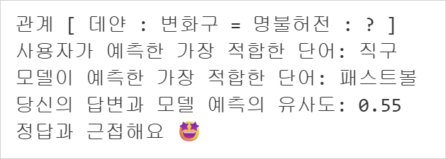
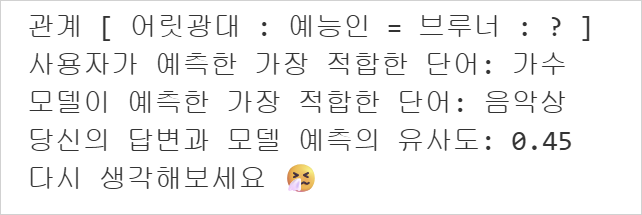

# Wonderful_Word_Game 🧙‍♀️

🕹️ 단어 간의 유사도를 이용해서 정답을 유추하는 게임 

- **설명** <br>
    - A:B = C:D 관계에 대응하는 D를 찾는 게임을 만든다.<br>
    - ex) A: 산, B: 바다, C: 나무, D: 물

### 1. 사용한 데이터 셋 🎙️

제가 사용한 데이터 셋은 **한국어 웹**에서 수집된 텍스트로 구성된 대규모 말뭉치 데이터입니다.

|항목|설명|
|---|---|
|출처|[huggingface🤗](https://huggingface.co/datasets/HAERAE-HUB/KOREAN-WEBTEXT)|
|크기|4.47GB|
|행의 수|1,284,879개|
|토큰 수|약 22억개|
|언어|한국어|
|주요 컬럼|text, source, token_count|


```python
# 다음의 코드를 사용하여 데이터 셋 로드
import datasets

dataset = datasets.load_dataset('HAERAE-HUB/KOREAN-WEBTEXT-1B')
```

전체 데이터 셋의 크기가 너무 커서 모델 학습 과정에선 행의 수를 1만개로 자른 샘플 데이터를 사용하였습니다. 


### 2. 대응 기준

✔️ C 선정 기준: A와 유사한 단어 후보군 추출(유의어)
<br>
  - A와 의미적으로 가장 가까운 상위 50개 단어를 후보로 선택
  - 이미 선택된 A, B와 중복되지 않도록 필터링


### 3. 실행 결과

✔️ **유사도가 50% 이상일 때 -> 정답과 근접**



✔️ **유사도가 50% 이하일 때 -> 오답**




